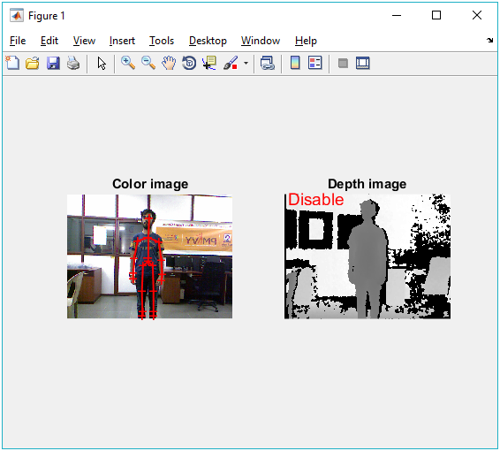

# Real Time Human_Action_Recogntion

This MATLAB code is written for REAL TIME HUMAN ACTION RECOGNNITION using FUZZY LOGIC.

Kinect camera has been used to acquire input sequence following is screenshot for kinect.

